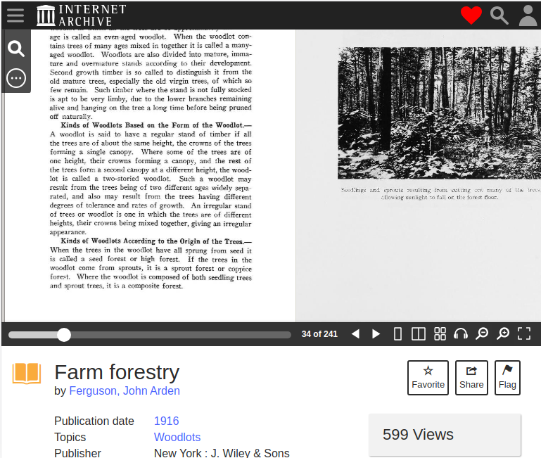

# V1 - Throw Away Version

The code for version 1 can be seen at the following commit has:
[61ae48e4fb8747c6d45fcb43a5f959d0ff24b932](https://github.com/FaisonZ/book-finder-react/tree/61ae48e4fb8747c6d45fcb43a5f959d0ff24b932)

## The Plan

Since I didn't know how the Open Library and Archive.org APIs worked, I decided
to take a "Build it to throw away"-first approach. By doing this, I could
figure out how to build it without worrying about project structure, then build
it again while considering project structure and best practices.

I started with the following rough user stories:

* As a user, I can perform a search and view a list of books found
* As a user, I can select one or more books to search through
* As a user, when I search through selected books, I can view a list of my
  found searches with deep links to each search result

## Searching for Books

I set out to understand all that I could about the [Open Library Search API](https://openlibrary.org/dev/docs/api/search).
It had some documentation, but required a bit of trial and error. Book data had
many two/three character property keys, there was an array of Internet Archive
ids, half of the ids pointed to books in different languages, it was all over
the place.

I managed to filter results down to books that Archive.org has the full text
available and by including book editions that were only in English, I was able
to get results that made sense for me:

<figure>
  <figcaption>The Book Finder with the book search field.</figcaption>
  
</figure>

<figure>
  <figcaption>The books that were found while searching for "forestry".</figcaption>
  
</figure>

## Searching in Books

From this point, all I had to do was use the [Search inside individual book API](https://openlibrary.org/dev/docs/api/search_inside).
So I passed in the selected book edition's key and the search param, and then
immediately realized that the API asks for an Internet Archive ID and not an
Open Office ID. And that Open Office ID doesn't exist in the Book Edition data
returned from the first API.

At this point, I needed to bring in another API endpoint, what I'll refer to as
the "Book Metadata Endpoint": `archive.org/metadata/{identifier}`. This gives
the Internet Archive ID for a book, and also gives other information needed to
build out the Search URL.

With that built out, I could then select a book and search for something inside
the selected books.

<figure>
  <figcaption>Selecting a book and entering the search string.</figcaption>
  
</figure>

<figure>
  <figcaption>Viewing the results.</figcaption>
  
</figure>

<figure>
  <figcaption>Where we end up when we follow the deep link.</figcaption>
  
</figure>

## Searching for Issues

### Search Forbidden

This first version worked great when looking for Forestry books and searching
for the word "Coppice", but I ran into other issues searching for the word
"dwarf" in Fellowship of the Rings.

All of the APIs used in version 1 can be accessed via a browser, which is where
I refined most of the API URLs to return what I needed. So I found all the
pages that contained "dwarf" in Fellowship of the Rings without issues in the
browser. However, nothing happened when I searched for "dwarf" with this React
App.

Nothing happened, because I was receiving a 403 Forbidden response from the
Search inside individual book API. The best that I could determine is this:
Fellowship of the Rings is not publicly available and needs to be borrowed to
read; since I was logged in to my Internet Archive account in my browser, I was
allowed to search in the book using the API URL; but when used my React App, I
was not logged in and was blocked from searching.

To solve this issue for version 1, I restricted book searches to publicly
available books.

### Off by Some Error

While testing the deep links across different books in different categories, I
learned that some of my deep links were several pages off. Looking at the books
on the Internet Archive, page 1 didn't start until several pages in, which
explained the offset.

Luckily, the Book Metadata Endpoint includes a `page_numbers` field that
included an array of `pages` that contains the following data:

```Typescript
{
    leafNum: number;
    confidence: number | null;
    pageNumber: string;
    pageProb: number | null;
    wordConf: number | null;
}
```

I have no idea what `pageProb` or `wordConf` is, but `leafNum` and `pageNumber`
contained the info I needed. `leafNum` was the number that the Search inside
individual book API returned, and `pageNumber` was the actual page number that
I could deep link to.

My solution for this in version 1 was to accept that the links would be off
sometimes. Version 1 is not setup in a way to easily access the book metadata
while processing the in-book search results. So this will be tackled properly
in Version 2, now that I know it's a problem that needs solving.

## Takeaways

With version 1 completed, I learned quite a lot of important things about the
Open Library and Internet Archive APIs and the Application I'm building:

1. What APIs are needed
2. What fields are needed
3. You can't search in a non-public book without being authorized
4. In-book search results return the `leafNum` and not the `pageNumber`
5. A book's metadata can be used to convert `leafNum` into the correct
   `pageNumber` used for deep links
6. There is a lot of information to display on screen, so the App needs to be
   designed with that in mind
7. Book data and book metadata needs to be stored in a way that can be easily
   used by other parts of code (like for `leafNum` to `pageNumber` conversion)
8. This project would have been really frustrating if I tried to design the app
   before building it first
